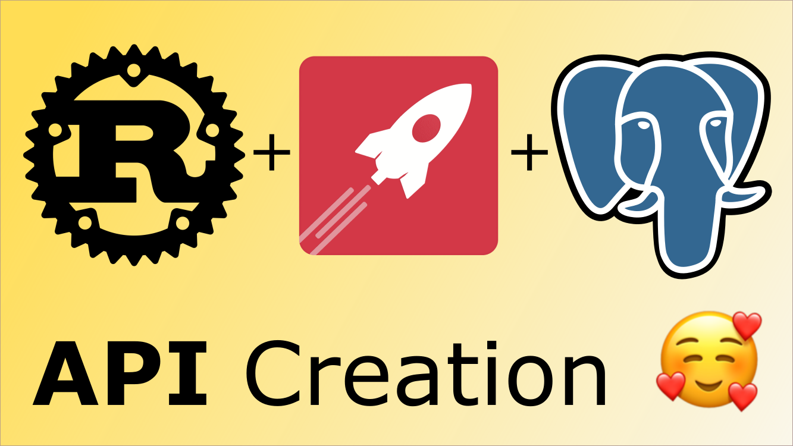

# RUST FOR BACK-END DEVELOPMENT: FROM NEWBIE TO GOD 🚀🔥

This is a very practical approach to learn Rust and start building working software from day 1.

## RUST FOR BACK-END COURSE
[YouTube](https://www.youtube.com/watch?v=nnuaiW1OhjA&list=PLxM2CWwQlzBt6-t8MK1Y1PQBJ5aOoJfUB)

## Social Media
[YouTube](https://www.youtube.com/c/SecurityUnion)

[Facebook](https://www.facebook.com/muchsecure)

[Instagram](https://www.instagram.com/security.union/)
